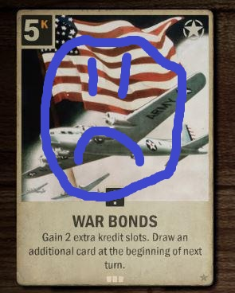

## How many games does it take to rank up in KARDS?

We might judge a general by their chance of winning a battle. Yet, as the apocryphal adage goes, “quantity has a quality all its own.” Should we favor a general with only a slight edge but many battles under their belt, or one who’s fought fewer skirmishes but wins far more consistently?

Today, we dive into the online World War II strategy card game KARDS to see what really matters for climbing the ladder: a player’s win rate or the sheer number of games played.

# The Simulation

KARDS uses a ladder system where you earn stars for wins and rank up every five stars. The ultimate goal is to reach *Field Marshal* (Rank 1).

We model rank progression as a series of weighted coin flips:

- You start at 0 points  
- You “rank up” in 5‑point increments  
- Each **heads** flip gives +1 point  
  - **(win‑streak bonus)** after two consecutive wins, each additional win grants 2 points until you lose  
- Each **tails** flip gives −1 point  
  - **(rank‑down guard)** when your score is a multiple of 5, it takes **three** losses in a row to lose a point  
    - in other words, at multiples of five, the first two losses are “free”  
- The simulation ends when you reach 20 points (climbing from Rank 5 to *Field Marshal*) or 25 points (e.g., moving from Rank 25 to Rank 20 or Rank 6 to Rank 10).  
  - In KARDS, you can’t drop below the bottom of each five‑rank bracket (Ranks 25, 20, 15, 10, 5, and 1). That means it only makes sense to model a climb of five ranks at a time (e.g., 15→10) or the final four‑rank jump (5→Field Marshal).  
    - In other words, going from Rank 25 to 15 is just two successive five‑rank climbs, since once you hit Rank 20 you’re protected from falling back below it.  

For each assumed win rate (the coin’s probability of landing heads), we flip until the game ends, repeat 1,000 trials, and average the number of flips required.

For simplicity, I vary the win rate in 2.5% increments, starting from a (rather abysmal) 30% win rate *(roughly what you experience when you put War Bonds in your deck)*.

# Results

Here's our first graph, modeling the climb from rank 5 to rank 1.

Yikes! It's pretty clear that if you have a very low chance to win a game, you're unlikely to make much progress towards ranking up. At 30% win rate, it took on average over 27,000 games to reach Field Marshal!

*(I tried with lower win percentages, but even with, say, 25% win rate, the simulations took literal hours and didn't complete.)*

Since success at those low win percentages takes a lot of unlikely streaks, we'd expect high variance for each trial that ends. Let's set those aside and trust that the KARDS matchmaking engine pairs players of roughly equal skill together; so lets turn to the smoother part of the curve, the 40%+ range.

I mentioned before that the higher percentages are smoother, and attempted linear fits show it (TODO).

This linearity means that, it takes, roughly, an absolute X percent increase in your win rate to halve the number of games you'd expect to play. (In other words, if you won X% of the time, you'd play twice as many games to rank up as someone winning Y% of the time).

## What about the five-rank climb (like rank 10→6)?

Naturally, if we want to model a five-rank climb (like rank 25→20), the lower win rates struggle even more:

# Takeways and Tips for Ranking Up!

Alright, we made some graphs, but how do you employ this to rank up faster? Some tips:

- *When in doubt, aggro 'em out.* It's more important to get reps in than it is to optimize your win percentage, unless you're much better than your opponents.
  - From a gameplay perspective, too, aggressive decks just have reasonable game against almost *anything*. Annecdotally, from my years of play experience, just being on the play gives you a good shot as an aggro deck, even against decks specifically designed to prey on the aggressive decks.
  - In other words, if you're trying to put War Bonds in your deck, you have to be extremely confident in your own skill and/or your metagame choice.

But, if you're just playing for fun, do whatever you'd like.

# Hypothetical: 

It’s clear that the star‑earning policies of KARDS are designed to help players climb the ranks—but how much do they actually boost your progress?

We can re-run our simulations under three alternative rule sets:
- *No win‑streak bonus:* each win is worth only +1 point.  
- *No rank‑up loss‑streak guard:* every loss always costs −1 point.  
- *No help at all:* wins +1, losses −1 with neither bonus nor guard.  

